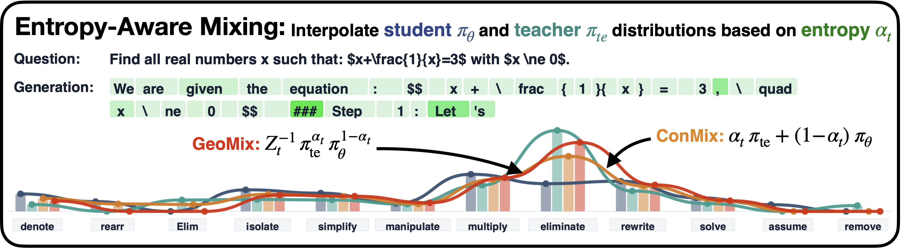

# Learning What to Imitate: Entropy-Aware Distribution Mixing

<a href="https://arxiv.org/abs/2610.06671"></a>
<a href="#citation"></a>


## 📖 Introduction
This repository contains the code for **Entropy-Aware Mixing**, a token-level distillation method that dynamically interpolates between student and teacher distributions using the student’s predictive entropy. The mixed target stays closer to the student in low-entropy states and shifts toward the teacher as uncertainty increases, reducing disruptive updates while concentrating teacher guidance where it is most useful.

<div align="center">

</div>

## 🔨 Installation
For NVIDIA GH200 (aarch64) clusters with CUDA 13.1, we provide a pre-configured Dockerfile based on the NGC vLLM container.

```bash
# Build the image
podman build -t entropy-aware-mixing:26.02-py3 .

# Export for cluster use (enroot/squashfs)
enroot import -o entropy-aware-mixing.sqsh podman://entropy-aware-mixing:26.02-py3
```


## 🚀 Getting Started
The scripts are Slurm-oriented and expect to be submitted from this directory.


### Synthetic-Trace SFT

```bash
# Generate rollouts
sbatch generate_rollouts.sh

# Submit SFT after rollout generation completes
sbatch train_sft.sh
```

### On-Policy Distillation

```bash
sbatch train_opd.sh
```

Select the objective by editing `ALGORITHM`:

- `opd`: OPD-style distillation
- `fkl`: forward KL distillation

Select `MIXING_MODE` as `none`, `fixed`, or `entropy`. Be aware that, for fixed and entropy, there are other variables you need to set.

### Verification

```bash
sbatch verify.sh /path/to/model
```

## 📝 Citation

To cite our work, you can use the following:

```bibtex
@misc{giraldo2026learningimitateentropyawaredistribution,
      title={Learning What to Imitate: Entropy-Aware Distribution Mixing}, 
      author={Juan Garcia Giraldo and Matteo Santelmo and Eduard Durech and Imanol Schlag and Valentina Pyatkin and Antoine Bosselut},
      year={2026},
      eprint={2610.06671},
      archivePrefix={arXiv},
      primaryClass={cs.LG},
      url={https://arxiv.org/abs/2610.06671}, 
}
```

## Attribution

Our implementation builds on a recent version of [verl](https://github.com/verl-project/verl).
The baseline implementations for [EAFT](https://github.com/PRIS-CV/EAFT), [EOPD](https://github.com/WLS04/EOPD), and [TAID](https://github.com/SakanaAI/TAID/) are maintained in separate branches of their respective repositories.
